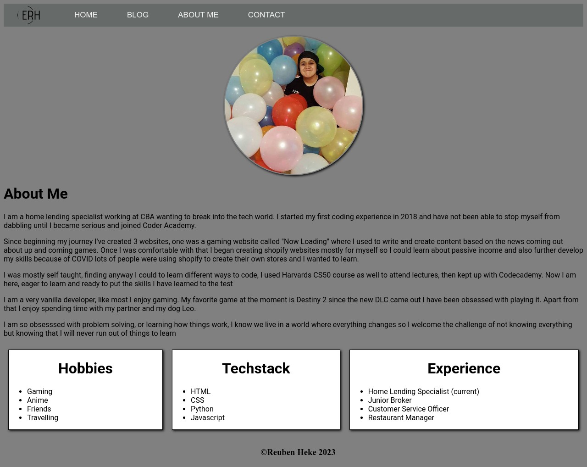

# Coder Academy - Assignment T1A2 by Englesh Reuben - Heke

## Links
* [Published portfolio Website](https://reubenheke.com.au)
* [Github Repo](https://www.github.com)
* [Presentation](../docs/T1A2_presentation.mp4)
* [Powerpoint](../docs/T1A2_Powerpoint.pptx)

## Purpose

The purpose of this project is to gain potential employers interest, its to showcase my abilities as a Full Stack Web Developer.

## Functionality/Features

The main functionality of this project is its responsiveness to all systems, whether its mobile, table or desktop you view it on, it is responsive enough to not complete mess with look of the web page and still maintain its look. I used a very simple approach as I much enjoy look at uncluttered websites and decided to keep up with that theme.

There is a couple of Features in this project:
* A Home Page, The first thing that catches your eye and has the most important information on it, my name, what I do and a link to the projects I have completed.
* An About Page, This has a couple of personal details about myself and what I enjoy doing, it also includes some previous work history and my experience with specific programming languages.
* A blog page, this is a placeholder at the time but to show I can create a page that does display blog information.
* A contact page, this is how you can get in contact with myself and also displays my resume and links to my social media.

## Site Map

## Screenshots

### Home

### Blog

### About Me

### Contact

## Target Audience

The Target Audience for this website is potential employers.

## Tech Stack

* Sitemap - Gloomaps
* Deployment - Netlify
* Slide Deck - Powerpoint
* Website - Html & CSS`